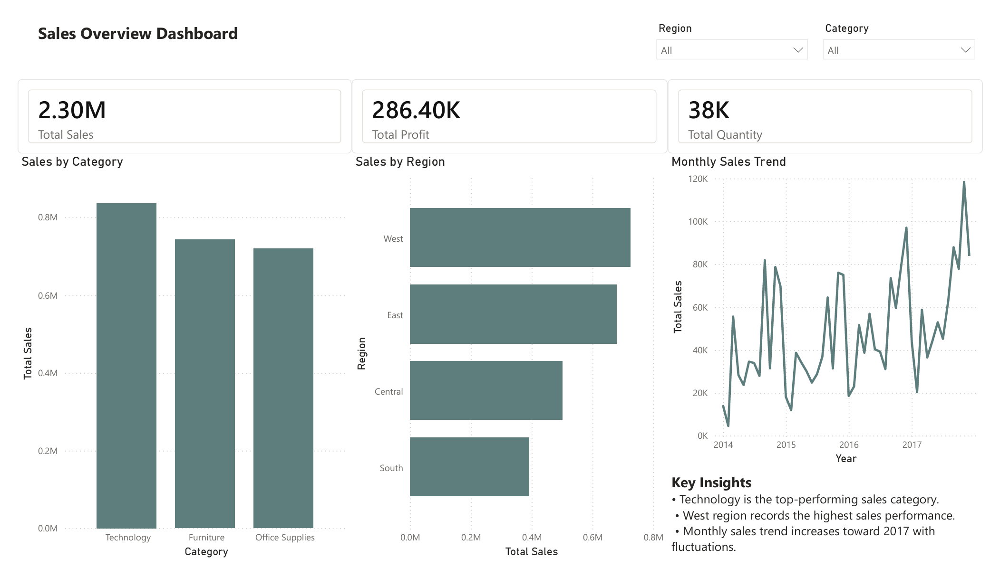
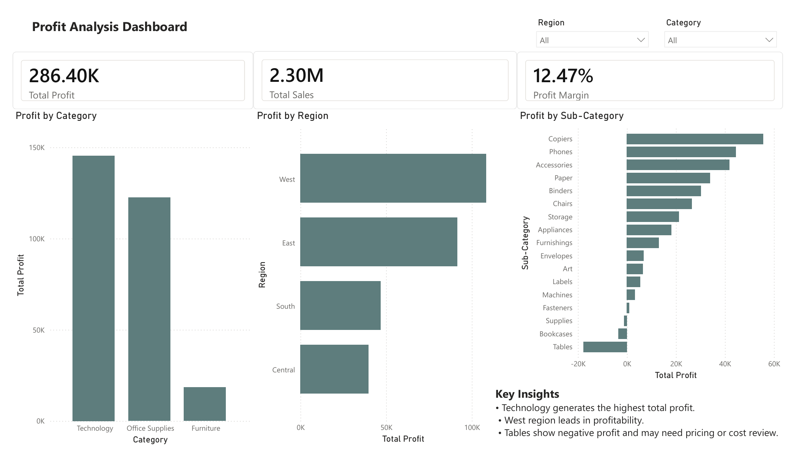
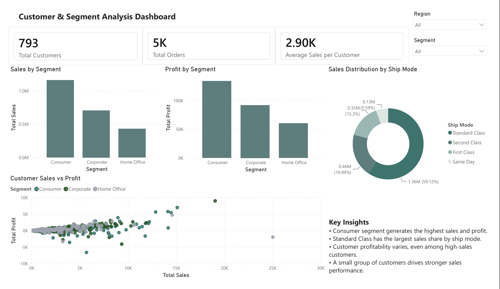

# Superstore Sales & Profit Analytics Dashboard

  An interactive Power BI business analytics dashboard designed to analyze sales performance, profitability, customer behavior, segment performance, shipping distribution, and loss-making sub-categories using KPIs, slicers, DAX measures, and business insights.

  
  
  

---

## Project Overview

This project analyzes the Superstore dataset using Power BI to transform raw sales data into clear business insights.

The dashboard focuses on three main areas:

- Sales performance overview
- Profitability and loss analysis
- Customer and segment analysis

The goal is not only to visualize the data, but to identify patterns, compare performance across regions, categories, customer segments, and shipping modes, and highlight areas that may require business review.

---

## Tools & Skills Used

| Tool / Skill      | Purpose                                        |
| ----------------- | ---------------------------------------------- |
| Power BI          | Dashboard design and data visualization        |
| DAX (Data Analysis Expressions) | Created a Profit Margin measure for profitability analysis |
| Slicers           | Interactive filtering by region and category   |
| KPI Cards         | High-level business metrics                    |
| Business Analysis | Turning data into insights and recommendations |

---

## Dashboard Pages

### 1. Sales Overview Dashboard

This page provides a high-level view of sales performance, including total sales, total profit, total quantity, sales by category, sales by region, and monthly sales trends.

It includes interactive slicers that allow users to filter the dashboard by region and category.

---

### 2. Profit Analysis Dashboard

This page focuses on profitability analysis, including total profit, total sales, profit margin, profit by category, profit by region, and profit by sub-category.

It helps identify both high-performing areas and loss-making sub-categories.

---

### 3. Customer & Segment Analysis Dashboard

This page analyzes customer and segment performance, including total customers, total orders, average sales per customer, sales by segment, profit by segment, sales distribution by ship mode, and the relationship between customer sales and profitability.

## Key Metrics

| Metric         |   Value |
| -------------- | ------: |
| Total Sales    |   2.30M |
| Total Profit   | 286.40K |
| Total Quantity |     38K |
| Profit Margin  |  12.47% |
| Total Customers | 793 |
| Total Orders | 5K |
| Average Sales per Customer | 2.90K |

---

## Key Insights

- Technology is the strongest category in both sales and profit.
- West region records the highest sales and profitability performance.
- Furniture contributes to sales but generates significantly lower profit compared to Technology and Office Supplies.
- Tables show negative profit, suggesting a need to review pricing, discounting, or cost structure.
- Consumer segment generates the highest sales and profit.
- Standard Class has the largest sales share by ship mode.
- Customer profitability varies, even among high-sales customers.
---

## Business Recommendation

Based on the profit analysis, the Tables sub-category should be reviewed further due to its negative profit performance. This may require evaluating pricing strategy, discount levels, cost structure, or sales approach.

---

## Skills Demonstrated

- Built an interactive business analytics dashboard using Power BI.
- Created KPI cards and slicers for dynamic filtering.
- Used DAX to calculate profit margin, total customers, total orders, and average sales per customer.
- Analyzed sales, profit, regional trends, customer segments, ship modes, and sub-category performance.
- Used scatter analysis to compare customer sales and profitability.
- Translated raw data into business insights and recommendations.
---

## Project Files

- [Power BI Report File (.pbix)](./Superstore%20Sales%20%26%20Profit%20Dashboard%20-%20Raghad.pbix)
- [Dashboard PDF Preview](./Superstore%20Sales%20%26%20Profit%20Dashboard%20-%20Raghad.pdf)
- [Dashboard Screenshots](./images)

---

## Dataset

This project uses the [Superstore dataset from Kaggle](https://www.kaggle.com/datasets/divyjn28/superstore-dataset), which includes sales, profit, category, region, order date, and product-level data for business performance analysis.

---

